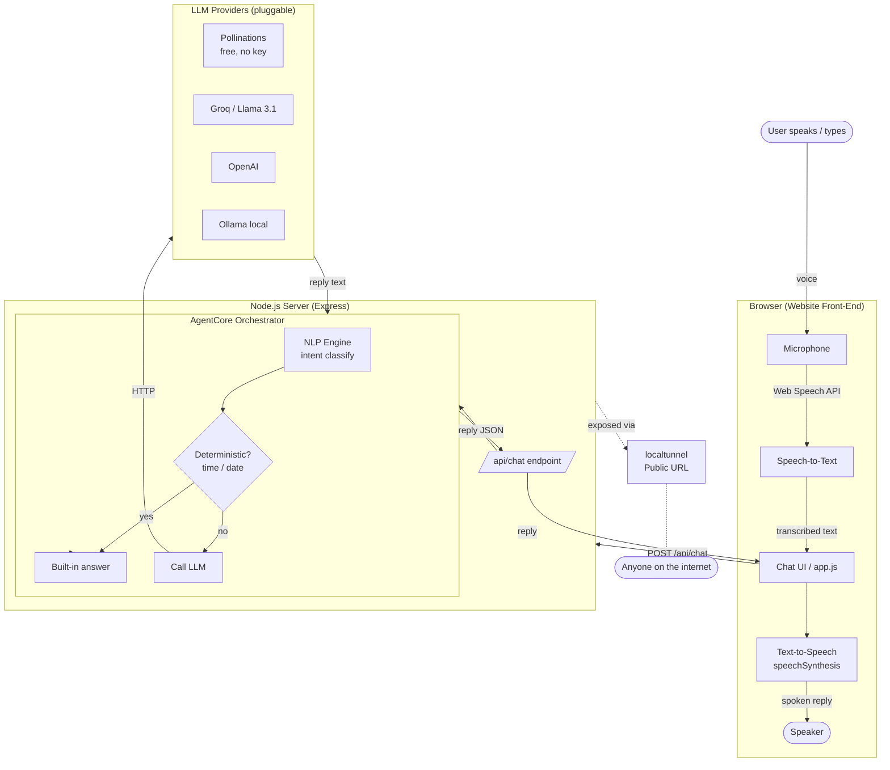

# Architecture & Demo

This document explains how the AI Voice Chatbox works and shows a sample of it
in action.

## System architecture

The app has three logical layers that map directly to the project's core
requirements — **NLP**, **AgentCore**, and **LLM** — wrapped by a browser
front-end (voice in/out) and a Node.js server that can be exposed on a public URL.



### Layer responsibilities

| Layer          | File                  | Responsibility                                             |
| -------------- | --------------------- | ---------------------------------------------------------- |
| Speech-to-Text | `public/app.js`       | Capture the mic and transcribe speech (Web Speech API)     |
| Chat UI        | `public/*`            | Render conversation, call the API, play spoken replies     |
| API            | `server/index.js`     | `POST /api/chat`, `GET /health`, serve the static site     |
| **NLP**        | `server/nlp.js`       | Classify intent and normalize/tokenize the utterance       |
| **AgentCore**  | `server/agentcore.js` | Orchestrate: answer locally (time/date) or delegate to LLM |
| **LLM**        | `server/llm.js`       | Generate answers via a pluggable provider                  |
| Public URL     | `server/tunnel.js`    | Expose the local server on the internet (localtunnel)      |

## Request flow, step by step

1. You press the mic and speak. The browser transcribes your speech to text.
2. `app.js` sends `POST /api/chat` with the text and recent history.
3. `AgentCore` runs the **NLP** classifier to detect intent.
4. If the intent is a deterministic fact (time/date), it answers locally.
   Otherwise it forwards the message (with the intent as a hint) to the **LLM**.
5. The reply is returned as JSON and displayed in the chat.
6. The browser reads the reply aloud with text-to-speech.

## Sample demo — how the AI chatbox works

Below is a real sample of what a session looks like. Anything the user says is
spoken into the mic; the bot's reply is both shown on screen and spoken aloud.

```
[Page loads]
BOT:  Hi! I'm your AI voice assistant. Tap the microphone and ask me anything.

USER: (speaks) "Hello there"
BOT:  Hello! I'm your AI voice assistant. How can I help you today?
      [intent: GREETING · source: builtin]

USER: (speaks) "What time is it?"
BOT:  The current time is 1:44:42 pm.
      [intent: TIME · source: builtin]     ← computed locally, never guessed

USER: (speaks) "What is the capital of France and one fact about it?"
BOT:  Paris is the capital of France, and it's famous for the Eiffel Tower,
      which was originally built as a temporary exhibit for the 1889 World's Fair.
      [intent: LLM · source: pollinations]  ← answered by the free LLM

USER: (speaks) "Tell me a fun fact about the ocean"
BOT:  The ocean produces over half of the world's oxygen, most of it from tiny
      drifting plankton rather than large plants.
      [intent: LLM · source: pollinations]

USER: (speaks) "Thank you, goodbye"
BOT:  Goodbye! Have a great day.
      [intent: GOODBYE · source: builtin]
```

### Try it yourself with the API

You can exercise the same brain the UI uses, directly over HTTP:

```bash
curl -X POST http://localhost:3000/api/chat \
  -H "Content-Type: application/json" \
  -d "{\"message\":\"what is the capital of France?\"}"
```

Example response:

```json
{
  "reply": "Paris is the capital of France...",
  "intent": "LLM",
  "confidence": 0,
  "source": "pollinations"
}
```

`GET /health` reports the active provider:

```json
{ "status": "healthy", "llmProvider": "pollinations", "llmEnabled": true }
```

## Notes

- Voice input works best in Chrome or Edge (Web Speech API). Typing works everywhere.
- The default LLM (`pollinations`) is free and needs no key. For higher reliability,
  set `LLM_PROVIDER=groq` with a free key from https://console.groq.com/keys.
- If the LLM is ever unreachable, AgentCore falls back to the built-in NLP engine
  so the chatbox keeps responding.
